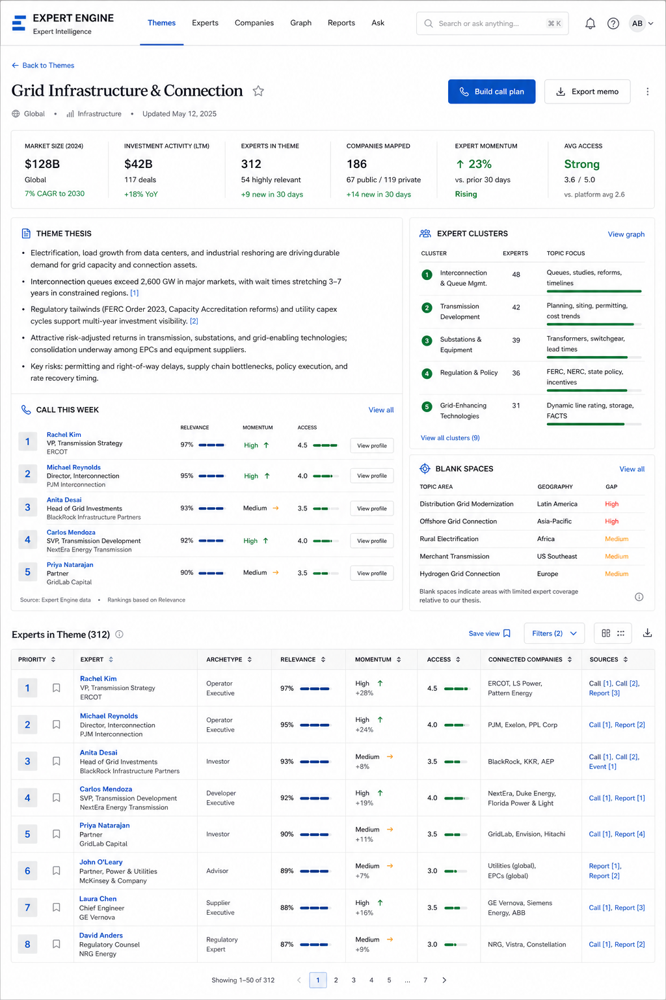
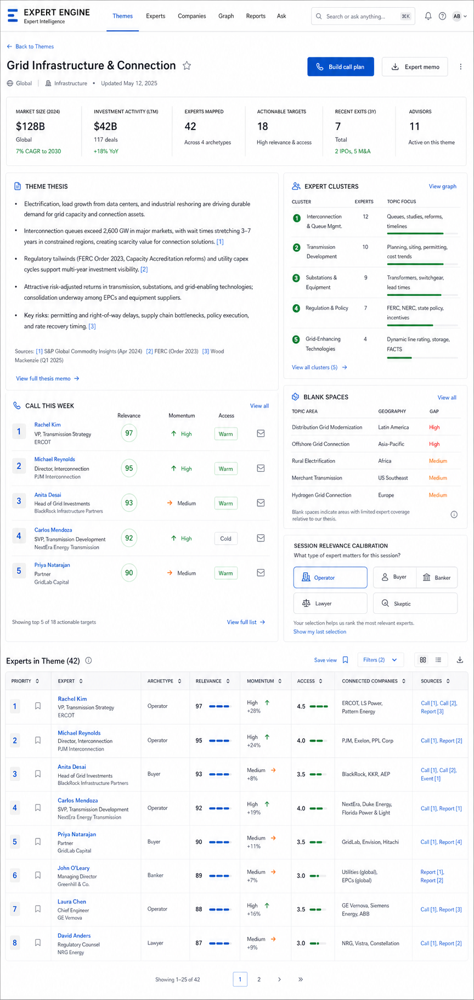
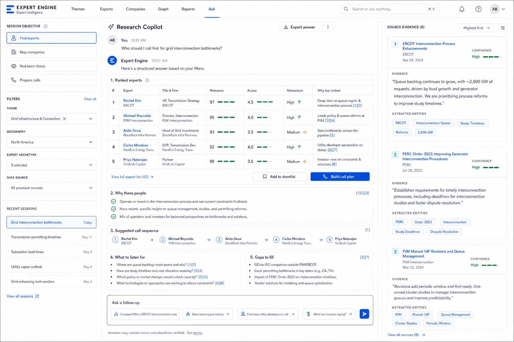
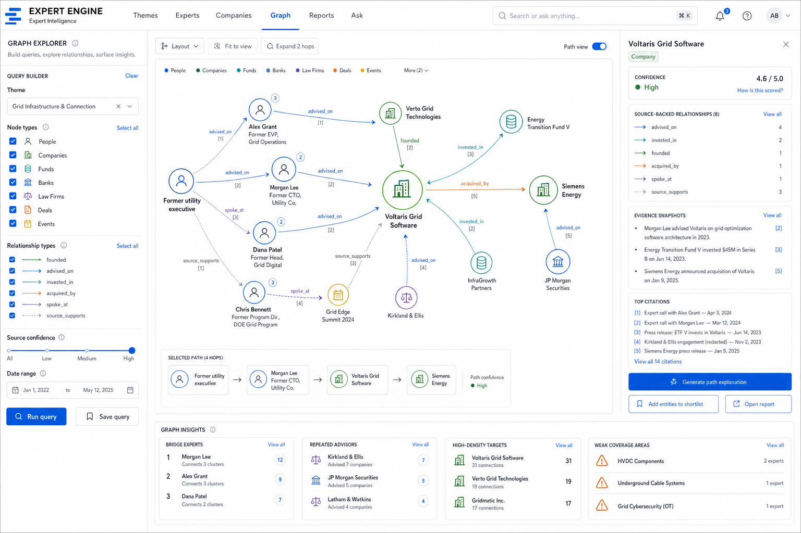
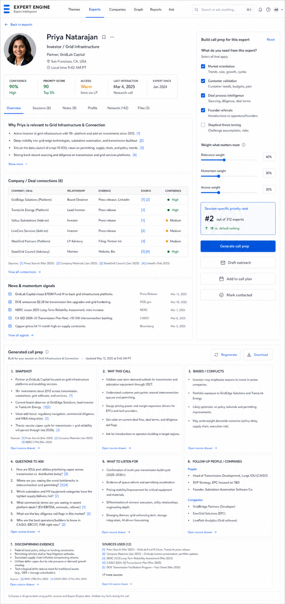
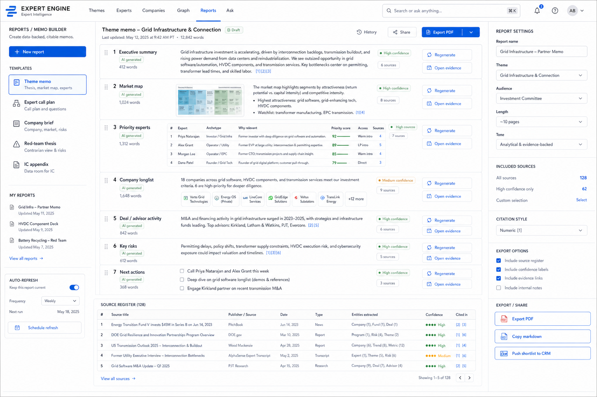

# Expert Engine UI Mockups

_Created: June 2026. Purpose: translate the product strategy, vendor research, and previous AI planning into concrete screens for the next version of the web app._

## Design Direction

The product should feel like an investment command center, not a generic chatbot or a database clone.

Core principles:

- **Table first, graph second.** Investors need ranked rows they can act on. The graph explains why a row exists.
- **Evidence before prose.** Every generated claim should expose source markers, confidence, and entity/edge provenance.
- **Chat as workflow control.** The chat should return structured outputs and update filters, shortlists, call plans, reports, and graph views.
- **Session-aware ranking.** The same expert is not always the best expert. The app should ask what the user is trying to learn in this session.
- **Reports are assembled objects.** A memo should be generated section-by-section with citations, evidence drawers, and export controls.

## Concept Screens

### 1. Theme Command Center - Market Map Variant



Use this when the theme page needs to feel like a broad market intelligence view.

Key elements:

- Top app shell with global command/search.
- Theme KPI strip: market size, investment activity, expert count, companies mapped, momentum, access quality.
- Partner-ready thesis panel with source markers.
- "Call this week" ranked expert list.
- Expert clusters and blank spaces on the right.
- Dense expert table below the fold.

### 2. Theme Command Center - Session Fit Variant



Use this as the main direction for the current product. It is closer to the existing app but adds session calibration and table rigor.

Key elements:

- KPI strip aligned to current product metrics: experts mapped, actionable targets, recent exits, advisors.
- Theme thesis with citations and source footer.
- Call list with relevance, momentum, access, and action icons.
- Right rail with expert clusters, blank spaces, and session relevance calibration.
- Sortable expert table with source links and save-view controls.

### 3. Ask / Research Copilot



The chat should not be a single answer box. It should be a structured research workspace.

Layout:

- Left rail: session objective, filters, recent sessions.
- Center: conversation plus structured answer blocks.
- Right rail: source evidence inspector.

Required chat output blocks:

- Ranked experts.
- Why these people.
- Suggested call sequence.
- What to listen for.
- Gaps to fill.
- Follow-up prompt chips.

The answer should be grounded in selected filters and should produce actionable UI state:

- Add experts to shortlist.
- Build call plan.
- Open source evidence.
- Export answer.
- Ask follow-up.

### 4. Graph Explorer



The graph should be a query and explanation surface, not a decorative network diagram.

Layout:

- Left query builder: theme, node types, relationship types, confidence, date range.
- Center graph canvas: people, companies, funds, banks, law firms, deals, events, sources.
- Right inspector: selected entity profile, relationships, evidence snippets, citations.
- Bottom insights strip: bridge experts, repeated advisors, high-density targets, weak coverage.

Graph rules:

- Default to a selected path or ego network, not the whole database.
- Edges must be labeled and source-backed.
- Path explanations should be generated from graph evidence, not from free-form model memory.
- The graph should answer investor questions: "How do we reach this company?", "Which advisor keeps appearing?", "Which expert bridges two themes?"

### 5. Expert Profile + Call Prep Builder



This should become the highest-conviction page for the demo because it closes the loop from research to action.

Layout:

- Expert header with priority score, access status, confidence, and last interaction.
- Tabs: overview, sessions, notes, profile, network, files.
- Evidence-backed relevance summary.
- Company/deal connections table.
- News and momentum signals.
- Right rail: "What do you need from this expert?" session fit form.
- Generated call prep as a structured report.

Call prep sections:

- Snapshot.
- Why this call.
- Biases / conflicts.
- Questions to ask.
- What to listen for.
- Follow-up people / companies.
- Disconfirming evidence.
- Sources used.

### 6. Reports / Memo Builder



Reports should look like an evidence-backed memo assembly tool, not a blank document editor.

Layout:

- Left rail: report templates and saved reports.
- Center: ordered memo sections with generation status, confidence, citations, and per-section controls.
- Right rail: report settings, included sources, citation style, export options.
- Bottom: source register table.

Report templates:

- Theme memo.
- Expert call plan.
- Company brief.
- Red-team thesis.
- IC appendix.

Each section should be independently regenerable and auditable. The user should be able to open evidence for a section before exporting.

## Full Page Inventory

The app should eventually have these primary pages:

| Page | Job To Be Done | Main UI Pattern |
|---|---|---|
| `/` Home | Pick a theme or resume a workflow | Theme cards + recent sessions |
| `/themes/[theme]` Theme Command Center | Understand a theme and who to call first | KPI strip + brief + ranked tables |
| `/ask` Research Copilot | Ask natural-language questions over the graph | Chat + structured answer blocks + evidence rail |
| `/experts` Expert Explorer | Filter and rank experts across themes | Dense sortable table |
| `/experts/[id]` Expert Profile | Decide whether and how to call a person | Profile + relationships + call prep builder |
| `/companies` Company Explorer | Find companies surfaced by people | Ranked company table |
| `/companies/[id]` Company Profile | Understand investment angle and relationship evidence | Profile + linked experts + diligence questions |
| `/graph` Graph Explorer | Explain relationship paths and network density | Query builder + graph canvas + inspector |
| `/reports` Memo Builder | Produce partner-ready outputs | Sectioned report canvas + source register |
| `/discover` Discovery Review Queue | Grow the graph with human review | Candidate table + accept/reject/merge |
| `/sources` Source Register | Audit evidence and ingestion quality | Source table + extracted entities |
| `/shortlist` Call Plan / Shortlist | Turn research into outreach sequence | Kanban/list + export + CRM actions |

## Chat Function

The chat should behave like an analyst copilot with tools, not like an open text box.

Recommended layout:

- **Left:** session setup and persistent filters.
- **Center:** messages, but assistant answers render as structured objects.
- **Right:** evidence inspector showing sources, snippets, confidence, and extracted entities.

Recommended interaction model:

1. User asks a question.
2. App classifies the intent: find experts, map companies, build call plan, red-team, generate memo, explain path.
3. App asks one clarifying question only if the answer materially changes ranking.
4. App retrieves graph records, source snippets, and current filters.
5. LLM produces structured JSON.
6. UI renders tables, lists, cards, citations, and action buttons from the JSON.

Example structured answer shape:

```json
{
  "intent": "find_experts",
  "answer_summary": "Start with two operators, then one buyer, then one banker.",
  "ranked_experts": [
    {
      "expert_id": "exp_123",
      "rank": 1,
      "why": "Direct view on interconnection queues and utility procurement.",
      "session_fit": 0.92,
      "citations": ["src_1", "src_4"]
    }
  ],
  "call_sequence": [
    {
      "phase": "Market orientation",
      "expert_ids": ["exp_123", "exp_456"],
      "goal": "Validate where bottlenecks are most severe."
    }
  ],
  "what_to_listen_for": [
    {
      "claim": "Queue reform is reducing timelines.",
      "raises_conviction_if": "Experts cite actual project acceleration.",
      "reduces_conviction_if": "Experts say reforms are procedural only.",
      "citations": ["src_2"]
    }
  ],
  "gaps": ["Municipal utility buyers are underrepresented."],
  "actions": ["add_to_shortlist", "build_call_plan", "export_answer"]
}
```

## Structured LLM Outputs

Generated outputs should be rendered as repeatable components, not paragraphs.

Core components:

- **Ranked entity table:** expert/company rows with score, reason, source markers.
- **Call sequence:** phases, expert archetypes, objective for each call.
- **Claim validation matrix:** claim, evidence for, evidence against, what to ask.
- **Risk / red-team block:** downside case, disconfirming questions, source support.
- **Evidence drawer:** source title, publisher, date, snippet, extracted entities, confidence.
- **Action footer:** add to shortlist, generate report, export, refresh signals.

Every generated section should include:

- `generated_at`
- `input_context`
- `sources_used`
- `confidence`
- `assumptions`
- `follow_up_actions`

## Data Source References

References should be visible at three levels:

1. **Inline citation markers:** compact markers like `[1]`, `[2]` next to claims.
2. **Evidence drawer:** source title, publisher, date, snippet, linked entities, confidence.
3. **Source register:** full table of all sources used in a report or session.

Source types to support:

- Company website.
- Transaction announcement.
- Banker/advisor deal page.
- Law firm deal page.
- Conference/speaker page.
- Trade press.
- Regulatory material.
- Expert transcript.
- CRM note.
- Internal call note.
- Paid data source record.

The UI should distinguish source origin clearly:

- Public source.
- Licensed source.
- Internal source.
- User-added source.
- AI-discovered candidate.

## Expert Ranking

There should be a base priority score and a session-specific priority score.

Base priority:

```text
base_priority =
  0.30 * theme_relevance +
  0.20 * relationship_strength +
  0.15 * access_quality +
  0.15 * momentum +
  0.10 * evidence_confidence +
  0.10 * non_obviousness
```

Session-specific priority:

```text
session_priority =
  base_priority *
  archetype_fit *
  geography_fit *
  objective_fit *
  source_confidence_adjustment
```

Recommended columns in expert tables:

- Priority.
- Expert.
- Archetype.
- Best use case.
- Relevance.
- Momentum.
- Access.
- Relationship strength.
- Connected companies.
- Key source.
- Confidence.
- Shortlist/contact status.

Expert archetypes:

- Market mapper.
- Operator.
- Buyer / customer validator.
- Founder referrer.
- Deal process insider.
- Banker.
- Lawyer.
- Regulatory translator.
- Technical diligence.
- Commercial diligence.
- Skeptic.

## Asking The User What Expert Is Relevant

The app should ask this once per session, then let the user adjust it in the right rail.

Recommended session calibration:

```text
What are you trying to learn in this session?
- Understand market structure
- Validate buyer pain
- Find investable companies
- Understand deal process
- Find founder introductions
- Red-team the thesis
```

```text
Which expert types matter most?
- Operators
- Buyers / customers
- Founders
- Bankers
- Lawyers
- Investors
- Regulators
- Skeptics
```

```text
What should we optimize for?
- Highest credibility
- Warmest access
- Most recent activity
- Non-obvious connectors
- Geographic relevance
- Transaction experience
```

The answer should update:

- Ranking weights.
- Recommended call sequence.
- Expert table sort.
- "What to listen for" prompts.
- Blank-spaces view.
- Report recommendations.

The calibration UI should live in:

- Theme Command Center right rail.
- Expert Profile call-prep rail.
- Research Copilot left rail.
- Shortlist/call-plan setup.

## Company Explorer Direction

The company explorer should be driven by people-surfaced evidence.

Recommended columns:

- Company.
- Category.
- Ownership status.
- Investment angle.
- Expert density.
- Independent expert mentions.
- Connected people.
- Connected deals/advisors.
- Momentum.
- Source confidence.
- Next action.

Ranking should reward:

- Multiple independent experts connected to the company.
- Founder/operator connection.
- Relevant deal/advisor evidence.
- Recent funding, M&A, hiring, partnership, or customer signal.
- Fit with selected theme and session objective.
- Actionability: independent or likely reachable beats already-acquired.

## Discovery Review Queue

Live discovery should not directly mutate the graph. It should create candidates.

Candidate row fields:

- Candidate person/company.
- Source URL.
- Extracted role.
- Suggested theme/specialty.
- Proposed relationships.
- Confidence.
- Duplicate warning.
- Accept, reject, merge, or request more evidence.

This turns the current discovery agent into a compounding dataset with human review.

## Implementation Priorities

Recommended build order:

1. **Theme Command Center table upgrade**: sortable expert/company tables plus session calibration.
2. **Research Copilot structure**: render answers as tables/blocks with evidence rail.
3. **Expert call prep builder**: session-fit right rail plus structured report sections.
4. **Reports / memo builder**: sectioned exportable memo with source register.
5. **Graph explorer**: path-first graph with inspector and source-backed edge labels.
6. **Discovery review queue**: persist candidates for human approval.

For the fellowship demo, the best sequence is:

```text
Theme -> session calibration -> ranked experts -> expert profile -> call prep -> company -> graph path -> memo export
```

